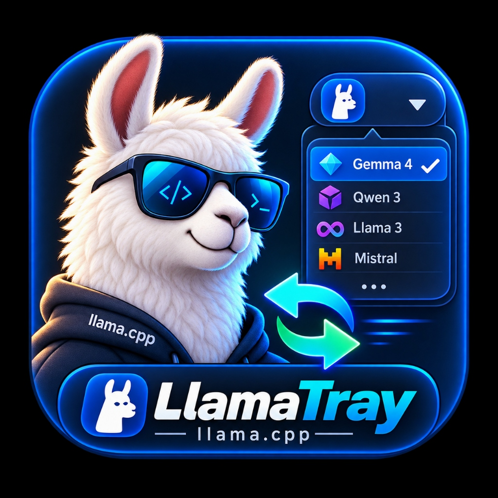

<p align="center">
  
</p>

<h1 align="center">LlamaTray</h1>

<p align="center">
  <b>A Lightweight, Native Win32 System Tray Host & On-Demand Model Switcher for llama.cpp</b>
</p>

<p align="center">
  
  
  
  
</p>

---

## ✨ Features

- 🚀 **100% Pure Native Win32 C**: Zero console windows, zero black flashing boxes, zero `.bat` wrappers, pure standalone executable.
- ⚡ **Asynchronous Multi-Threading**: Strict decoupling of the UI message pump and background workers — 0% UI freeze, instant right-click response.
- 📊 **Floating Graphical Progress HUD**: Real-time GDI double-buffered progress bar floating in the bottom-right corner displaying tensor weight loading percentages.
- 🧠 **Auto-Scanner & Dynamic Rule Engine**:
  - Automatically identifies and attaches external MTP Drafter models (`*-assistant.gguf`).
  - Automatically hooks multimodal vision projectors (`mmproj-*.gguf`).
  - Automatically enables native MTP multi-token prediction for supported architectures (e.g. Qwen3.8).
  - Automatically applies `q8_0` KV-cache quantization for large models (≥14B) to prevent VRAM overflow.
- 🎯 **Visual Active Model Checkmark**: Real-time `✓ [Active]` indicator on currently loaded models in the system tray menu.
- 🔌 **Unified OpenAI API**: Exposes standard `http://127.0.0.1:8888/v1` endpoint with automatic on-demand loading and idle VRAM reclamation.

---

## 🛠️ Build from Source

Compile with MinGW-W64 GCC:

```bash
# 1. Compile resource (embed application icon)
windres resource.rc -O coff -o resource.res

# 2. Compile standalone native executable
gcc -O2 -DUNICODE -D_UNICODE -Wl,-subsystem,windows -o llama-tray.exe tray.c resource.res -lwinhttp -lshell32 -lgdi32 -luser32 -lcomctl32 -lkernel32 -lole32 -lcomdlg32
```

---

## 📂 Directory Structure

```
F:\llama-tray\
├── assets/
│   ├── logo.jpg          # Official Mascot & Banner
│   └── app.ico           # Multi-resolution Windows Icon
├── bin/
│   └── llama-swap.exe    # High-performance Go dynamic model router
├── config.yaml           # Auto-generated routing configuration
├── llama-tray.exe        # Native Windows Tray GUI Binary (with embedded icon)
├── resource.rc           # Windows Resource script
├── tray.c                # Pure C Win32 Source Code
└── README.md
```

---

## 📜 License

MIT License. Open source and free to use.
